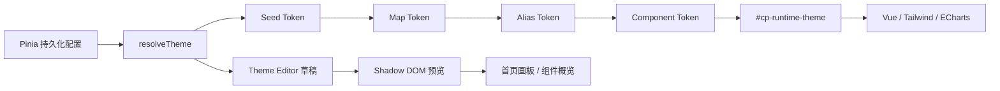

<!-- prettier-ignore -->
<div align="center">


# 管理端主题系统

浅色、深色、预置配色与自定义主题的配置和实现说明。

[设计原则](#设计原则) · [Token 模型](#token-模型) · [运行时架构](#运行时架构) · [主题编辑器](#主题编辑器) · [扩展指南](#扩展指南)

</div>

在管理端「主题」中调整颜色、字号、圆角和组件样式，保存后应用到当前浏览器。
设置保存在浏览器本地，不会同步到服务器或其他设备。只想换配色时，选择预置主题即可。

下文说明实现和扩展方式。颜色使用 Ant Design 十阶色板与项目的明暗角色规则，
中性表面从背景和文字 Seed 派生；Vue 组件通过 CSS Variables 与 Tailwind CSS 4 使用这些值。
项目不依赖 Ant Design 组件库或 CSS-in-JS。

> [!IMPORTANT]
> 主题的目标是调整颜色、密度、圆角与层级，不改变现有页面结构和产品语义。默认主题保留既有表面层级，并满足正常文字的可读性约束；
> 成功、警告、错误和业务数据色不会因为品牌色变化而失去原有含义。

## 设计原则

- **Seed 与 Map 可追踪**：主色和功能色均按 Ant Design 从 Seed 派生 P1-P10；浅色 P6 等于 Seed，深色 P6
  经过暗色色板适配。全局 `colorPrimary` 保留原始 Seed；功能色 Base 保留 P6。文字和按钮组件可在派生层做对比度校正，Seed 不随之改写。
- **主色与表面分离**：品牌色负责交互和强调，页面、容器、浮层与文字由独立的背景和文本 Seed 派生。
- **语义独立**：`success`、`warning`、`error`、`info` 不随品牌色隐式改变；未显式配置 `link`
  时跟随 `primary`，显式配置后独立派生。
- **无边设计**：默认依靠表面色差、间距和轻阴影表达层级；边框只用于焦点、错误和必要分隔。
- **运行时可定制**：用户输入在浏览器中实时派生，因此使用 CSS Variables，不使用构建时 SCSS 变量。
- **单一事实源**：Store 只保存最小配置，所有 Map、Alias 与未覆盖的 Component Token 均由纯函数生成。
- **行为透明**：任意自定义 Seed 都进入统一算法，页面只选择角色。功能色 `text` 与 `on-container` 分别依据中性
  Surface 和自身 Container 三态做对比度保护，不使用固定色相的文字锚点覆盖自定义 Seed；交互仍尊重
  `prefers-reduced-motion`。

## 界面文案与信息层级

管理端以查看状态和完成操作为主，延续紧凑的信息布局、清楚的主次关系，以及表面色差、间距和轻阴影构成的层级

- **先沿用已有设计**：先看原页面和最接近的同类实现，复用布局、控件、操作位置与状态展示，新增能力优先融入原有操作路径
  只有现有设计无法承载本次任务时才改变结构，并说明具体问题，不以个人审美或设计技能中的通用建议为由重做页面
- **文案不使用句号和分号**：自行编写的标题、标签、按钮、表单帮助、空状态、提示和错误文案不使用 `。`、句末 `.`、`；` 或 `;`，优先写成短语或简短分句
  需要表达多个要点时，按内容关系拆成字段、短行或列表，不把长段落机械替换成逗号串
  这项约定针对界面文案，URL、版本号、小数、代码、原始日志和用户输入保留原样
- **说明只补必要信息**：标题、字段值和操作已能表达的内容不再重复，不同时用帮助文字、状态行和说明卡解释同一事实
  页面保留当前决策必需的短提示，详细规则、背景原因、示例和低频帮助优先收进已有 Popover 或就近的帮助入口，不把实现细节写成用户教程
  重要说明可以在 Popover 中展开，但影响当前选择的关键限制、错误原因和不可逆后果需在操作处保留简明提示，不能全部藏起来
- **按内容选择提示方式**：Tooltip 用于短名称或单句补充，Popover 用于需要阅读、多段说明或含链接的内容，复用项目现有组件
  帮助入口需可识别、可通过键盘和触屏打开，图标提供可访问名称，不依赖悬停才能读到必要内容
- **避免大字报**：不堆叠超大标题、口号、整屏介绍、重复副标题或大段说明卡片，页面尽快进入数据、筛选和操作
  页面标题与关键指标沿用已有组件的强调方式，辅助说明使用正文或次级文字层级，不通过放大字号、加粗整段或增加大块留白来突出普通说明
- **按任务组织空间**：优先使用紧凑的工具栏、表格、表单和必要的指标卡，卡片承担独立的信息或操作职责，不为每段说明单独套卡
  密度以可读、可点击为边界，保留窄屏换行和必要的控件间距

开发时按任务选择参考入口，复用其职责和信息层级，具体布局仍以当前任务为准：

| 场景 | 参考入口 | 关注点 |
| --- | --- | --- |
| 页面头部 | `@codex-proxy/ui` 的 `BasePageHeader`、[系统概览](../frontend/src/views/dashboard/components/DashboardContent.vue) | 简短标题、必要的统计范围或状态、就近操作 |
| 内容与指标 | `@codex-proxy/ui` 的 `BaseCard`、[用量概览卡片](../frontend/src/views/usage/components/UsageSummaryCards.vue) | 可选说明、紧凑摘要、数值与辅助信息的主次 |
| 表单帮助 | [API Key 账号字段](../frontend/src/views/accounts/components/AccountApiKeyFields.vue) | 直接命名字段，在对应位置提供短提示和示例 |

## 架构概览



核心职责保持分离：

| 层 | 入口 | 职责 |
| --- | --- | --- |
| 基础组件 | `@codex-proxy/ui` | 稳定组件与通用函数，不承载业务状态 |
| 主题算法 | `@codex-proxy/ui/theme` | 规范化配置，派生 Seed → Map → Alias → Component，生成并提交 CSS Variables |
| 样式 | `@codex-proxy/ui/styles.css` | 基线、组件样式与完整工具类样式 |
| Tailwind 合同 | `@codex-proxy/ui/tailwind.css` | 公开 Token 名称，供应用自己的 Tailwind 构建使用 |
| 状态 | [`stores/modules/theme.ts`](../frontend/src/stores/modules/theme.ts) | 持久化配置、系统明暗偏好、切换动作与动画 |
| 编辑器状态 | [`useThemeEditor.ts`](../frontend/src/views/theme/composables/useThemeEditor.ts) | 草稿、修改计数、恢复与保存 |

独立仓库 `codex-proxy-ui` 是管理端和官方插件页面的共享组件源码；组件不得反向依赖管理端 Store、路由或 API。管理端通过 `@codex-proxy/ui` 公开入口消费组件，插件页面把组件和样式编译进自身静态资源，不在运行时借用宿主模块。
插件页面的标题与副标题由宿主呈现，内容区只渲染业务；主题变化通过宿主桥同步，接入方式见
[SDK 页面与宿主桥](../backend/crates/gateway-plugin/sdk/docs/capabilities.md#页面与宿主桥)。
`theme/` 根目录只保留公开入口 `index.ts` 和唯一类型文件 `types.ts`；内部实现按 `core/`、`derive/`、`runtime/` 分层，不增加嵌套 barrel。
纯派生模块不访问 DOM，`theme/runtime/browser.ts` 不包含派生规则，Theme Store 不复制算法。
普通 Map 字段按 camelCase → kebab-case 统一生成 `--cp-*`；Semantic 与 Preset Color 仅维护各自的短角色表。
`ThemeTokenName` 在 `types.ts` 中由 Map 契约推导，无需手写重复的联合类型和对象映射。

## Token 模型

主题采用四层模型：

```text
Seed Token → Map Token → Alias Token → Component Token
```

### Seed Token

Seed 是用户配置与持久化的最小事实：

```ts
type ThemeMode = 'system' | 'light' | 'dark'
type ThemeColorId = 'relay-blue' | 'deep-teal' | 'signal-violet' | 'graphite' | 'custom'

interface ThemeCustomization {
  seed?: Partial<ThemeSeedOverrides>
  component?: Partial<ThemeComponentOverrides>
  tokenOverrides?: Partial<ThemeTokens>
}
```

| 类别 | Seed |
| --- | --- |
| 品牌 | `colorPrimary`，由预置 ID 或自定义 HEX 提供 |
| 功能色 | `colorSuccess`、`colorWarning`、`colorError`、`colorInfo`、`colorLink` |
| 中性色 | `colorTextBase`、`colorBgBase` |
| 尺寸 | `fontSize`、`sizeUnit`、`sizeStep`、`controlHeight` |
| 风格 | `borderRadius`、`shadowStrength` |
| 组件尺寸 | `tableRowHeight`、`cardBorderRadius` |

持久化键为 `codex-proxy-rs-theme`。Store 不保存完整色板或 CSS Variables，损坏的模式、颜色与自定义值会在
初始化时规范化并回退到默认配置。

### Map Token

品牌色和功能色使用 `@ant-design/colors` 从一个 Seed 生成十阶色板。本文 P1-P10 指生成器返回数组的第 1-10 项，
不是 Ant Design 组件库再次重映射后的角色编号。项目的映射集中在 `theme/derive/roles.ts`：

| 角色 | 浅色 | 深色 |
| --- | --- | --- |
| 全局 Primary Base | Seed | Seed |
| 功能色 Base | P6 | P6 |
| Primary / 功能色 Hover、Active | P5、P7 | P8、P6 |
| Primary Text Hover、Text、Text Active | P5、P6、P7 | P8、P7、P6 |
| Primary On Container | P6 | P7 |
| 功能色 Text Hover、Text、Text Active | P5、P7、P7 | P8、P7、P10 |
| 功能色 On Container | P6 | P9 |

弱语义 Container 由中性 Container 与对应 Base/Hover/Active 按 recipe 权重混合；描边同样混色，再相对中性
Container 保证 3:1。功能色 Hover/Active 相对中性 Container 保证 3:1，Base 不做该校正。`text` 依据页面、
容器、浮层和交互填充等中性 Surface 校正；`on-container` 单独依据语义 Container 的默认、Hover、Active 三态
校正到至少 4.5:1，避免为了彩色底对比度而削弱中性表面上的颜色辨识度。
对比度校正由 UI 库的主题算法统一执行；互相矛盾的自定义前景/背景组合不保证全部达标。

分类、图表与数据强调继续使用 Ant Design Preset Color 的角色结构。Blue、Green、Orange、Red 分别复用
`colorInfo`、`colorSuccess`、`colorWarning`、`colorError`，保证通用彩色与可编辑语义 Seed 同源；没有语义对应的
Cyan、Purple 从 `@ant-design/colors` 的 `presetPrimaryColors` 取得 Seed。
Preset 的实心色使用 P6，普通 Container、Strong Container 与边界按 recipe 权重混合；浅色文字取 P7，深色取 P8
并保留 HSL 最低明度 0.7。`text` 相对中性 Container 校正，`on-container` 同时相对普通和 Strong Container
校正到 4.5:1；彩色容器里的文字与图标应使用 `on-container`，普通数值与标签不直接使用 `solid`。

背景与文本 Seed 进入独立的 Surface Map，生成：

- `colorBgLayout / Container / Elevated / Spotlight / Mask`
- `colorFillSecondary / Tertiary / Quaternary`
- `colorText / Heading / Secondary / Tertiary / Quaternary / Disabled`
- `colorBorder / BorderSecondary / Split / Shadow`

中继蓝使用稳定的浅色 / 深色中性基线；深海青、古风色与石墨预置额外提供各自的 `colorBgBase`、`colorTextBase`
画像，自定义主色则只向通用中性基线注入少量色温。默认浅色采用中性锚点，默认深色使用 HSL 色调派生；带色温
主题按外观距离平滑过渡到背景和文字 Seed 的 RGB 混色结果。稳定锚点用于 Surface 与 Shadow，Component 从角色派生，
所有预置、自定义 Seed 和用户覆盖仍进入同一条算法，不在页面或组件中追加 HEX 特判。
Input、阴影与其他 Component Token 从 Fill、Surface、Primary 和 Semantic 派生，不在常量文件维护整套颜色表。

正常文字同时检查 Layout、Container、Elevated、文字交互背景、三级 Fill，以及控件透明填充在各宿主上的合成色
和浅色的选中 / 选中 Hover 背景。正文、标题和 Secondary 至少 7:1，
Tertiary 至少 5.5:1，Quaternary 至少 4.5:1；这些是相对全部上述表面的最低目标，对 Container 的实测比值通常更高。
Disabled 保留独立的弱化颜色，不承担正常信息。控件填充由文字 Seed 和透明度派生，placeholder 继续消费
Quaternary；主按钮白字与功能色文字遵循各自的容器配对规则。

### Alias Token

Alias 按视觉角色命名，使用 `--cp-` 命名空间；整体分层对齐 Ant Design，并以 Container / On Container 表达成对的
语义表面与前景：

| 角色 | CSS Token | 主要消费者 |
| --- | --- | --- |
| 品牌交互 | `--cp-color-primary*` | 主操作、选中态、焦点与强调 |
| 链接 | `--cp-color-link*` | 普通文本链接 |
| 表面 | `--cp-color-bg-*` | 页面、容器、浮层和遮罩 |
| 填充 | `--cp-color-fill-*` | 轨道、弱背景和静态层级 |
| 文字 | `--cp-color-text*` | 标题、正文和辅助信息 |
| 选择 | `--cp-control-item-bg-active*` | Segmented、Select 和选择控件 |
| 焦点 | `--cp-control-outline` | 键盘焦点和输入反馈 |
| 功能色 | `--cp-color-info / success / warning / error-*` | 系统反馈与状态 |
| 预设彩色 | `--cp-color-{blue,cyan,green,orange,purple,red}-{container,container-strong,border,solid,text,on-container}` | 分类标签与数据强调 |

Alias 不在页面中追加修色；中性与彩色文字在派生层执行各自的背景配对约束。Component
Token 直接覆盖时不会自动重算同组件的其他状态；需要保持梯度关系时应修改 Seed，而不是逐个覆盖 Map Token。

### Component Token

当组件需要独立演进时，使用 `component[-part][-variant][-state]-property` 命名，不创造含义重复的全局别名。

| 组件 | 代表 Token |
| --- | --- |
| Button | `--cp-button-primary-color / bg / hover-bg / active-bg`、`--cp-button-secondary-bg / hover-bg / active-bg` |
| IconButton | `--cp-icon-button-secondary-bg / hover-bg / active-bg` |
| Input | `--cp-input-bg / hover-bg / active-bg / error-active-bg` 与对应 Shadow |
| Menu | `--cp-menu-item-selected-bg` |
| Popover | `--cp-popover-header-bg` |
| Table | `--cp-table-row-bg / stripe-bg / hover-bg / selected-bg / selected-hover-bg / height` |
| Card | `--cp-card-bg / border-radius / shadow` |
| Layout | `--cp-layout-sider-bg / shadow` |
| Scrollbar | `--cp-scrollbar-thumb-bg / hover-bg` |
| BrandMark | `--cp-brand-mark-bg` |

组件状态由 UI 库的 Component 派生层统一生成，页面不维护混色系数：

| 角色 | 状态与可读性约束 |
| --- | --- |
| 主按钮 | 白字背景至少达到 4.5:1；Hover / Active 加深，不反向改写 Primary Seed |
| 输入控件 | Input、Select、Textarea、NumberInput 共用 Token；常态无边，Hover 与 Focus 保持相同背景和外圈 |
| 次级操作 | 普通按钮与图标按钮各用自己的 Secondary Token；透明填充与宿主表面合成，`ghost` 无常态底色 |
| 表格 | 表头、斑马纹、Hover 独立派生；固定列使用不透明合成背景，选中行保留 Primary 语义 |
| 错误与焦点 | Hover / Focus 不覆盖错误反馈；焦点外圈不受装饰性阴影强度影响 |
| 浮层头部 | 浅色取 Secondary Fill，深色取 Tertiary Fill；箭头与头部使用同一 Token，不借用表格背景 |

明暗模式分别派生，但共用组件合同。表格背景过渡覆盖普通行、选中行和固定列，尊重减少动态效果偏好。

Theme Editor 只开放真正由对应组件消费的 Component Token。全局 Alias 不放进组件目录，避免一次覆盖同时改变
多个无关组件。

应用内品牌图标使用 [`AppBrandMark.vue`](../frontend/src/components/AppBrandMark.vue)：浅色模式取
`colorBgSpotlight`，深色模式取 `colorBgElevated`，保持中性暗面与白色图形；浏览器 favicon 继续使用固定黑白
图标，不随主题改变，由 `frontend/public/favicon.svg` 提供，页面通过 `/favicon.svg` 引用。

### 通用颜色消费

主题层禁止声明账号套餐、推理类型或具体页面名称。业务组件只能选择通用 Preset Color 角色，例如 Cyan Container、
Purple Strong Container 或 Purple Solid；同一组颜色仍由运行时色板统一派生。`styles/tokens.css` 只保留白色、透明色与
作用域 `color-scheme`，不保存可换肤值或业务标识色。账户活动热力图以 Success Container 为起点、Success Solid
为终点生成中间密度；浅色与暗色使用同一规则。
图表数据系列也只引用通用 Preset Color Token。

## 预置主题

| ID | 名称 | 主色 | 交互方向 |
| --- | --- | --- | --- |
| `relay-blue` | 中继蓝 | `#5983F4` | 清晰可信的冷蓝强调 |
| `deep-teal` | 深海青 | `#0E7C72` | 冷静低饱和的青色强调 |
| `signal-violet` | 古风色 | `#A0583D` | 温厚克制的赭色强调 |
| `graphite` | 石墨 | `#525B66` | 近单色的灰色强调 |

预置主题改变品牌主色，并可提供与该品牌匹配的浅色 / 深色背景和文字 Seed；不改变字号、密度、圆角或布局。
所有预置与自定义主题走同一条 Surface、Map、Alias 与 Component 派生链路，不存在页面级特判。

## 运行时架构

### 启动顺序

[`main.ts`](../frontend/src/main.ts) 在 Vue 挂载前初始化主题：

```text
createApp
  → app.use(pinia)
  → persistedstate 同步水合 Theme Store
  → themeStore.initializeTheme()
  → app.use(router / auth)
  → app.mount('#app')
```

Theme Store 统一读取持久化配置并初始化主题，首个 Vue 组件渲染时即可使用主题变量。

### CSS Variables 提交

全局主题由 `<head>` 中唯一的运行时样式节点承载：

```html
<style id="cp-runtime-theme">
:root[data-theme='dark'][data-theme-color='relay-blue'] {
  color-scheme: dark;
  --cp-color-bg-layout: #0B111C;
  /* 其余 Map、Alias 与 Component Token */
}
</style>
```

根元素只保留 `data-theme` 与 `data-theme-color` 状态，Token 统一写入运行时样式表。
全局弹窗通过 Teleport 挂到 `body` 后仍继承根变量。

> [!NOTE]
> Theme Editor 预览是例外：草稿 Token 以内联变量写在影子环境的局部根节点上，仅影响预览，不污染已保存主题。

### 切换与图表

- 用户主动切换时，以点击位置为圆心运行 View Transition；不支持时使用 180ms 颜色过渡。
- 初始化、系统主题变化或减少动态效果时直接提交，不播放扩散动画。
- 每次有效提交只增加一次 `themeRevision`，相同签名不会重复刷新。
- `useThemeColor()` 在正式页面读取根 CSS Variables，在影子预览中优先读取注入的局部 Token。
- 图表 Option 在主题 revision 或预览 Token 改变后重算，`BaseChart` 通过 `setOption` 更新现有 Canvas。

## 主题编辑器

主题编辑器位于一级路由 `/theme`，采用一屏工作台：左侧编辑，右侧预览，顶部保留全局操作。桌面端高度固定为
`100dvh - 3rem`，切换编辑层级或预览类型时不改变外框高度。窄屏头部操作允许自然换行；手机端隐藏实时预览，
只保留 Token 编辑，避免在有限宽度内渲染不可操作的缩放画板。

### 编辑能力

| 区域 | 能力 |
| --- | --- |
| 全局 / 颜色 | 模式、预置、自定义主色、功能色、链接、基础文本与背景、派生变量查看 |
| 全局 / 尺寸 | 字号、基础间距、尺寸步长、控件高度 |
| 全局 / 风格 | 通用圆角、阴影强度 |
| 组件 | Action、Form、Surface、Data Display、Navigation、Layout |
| 工作流 | 搜索、单项恢复、撤销草稿、恢复默认、保存并应用 |

Component Token 只开放白名单字段，且不允许在组件目录覆盖全局 Alias。未覆盖项始终继续使用全局 Seed 与
Alias 算法，避免主题配置逐渐退化成一份无法维护的完整 CSS 快照。
Input、Button Secondary 与 Icon Button Secondary 的三个背景 Token 支持 HEX Alpha 编辑和保存；Seed、容器与表格背景仍只接受实色。
透明填充先合成再参与默认文字对比度计算，用户显式覆盖 Component Token 时仍由用户负责整组状态的搭配。

### 草稿与保存

编辑器维护 `saved` 与 `draft` 两份状态：

1. 输入只更新草稿和局部预览。
2. 修改计数按模式、主题色、Seed、组件值和 Token override 分项统计。
3. “撤销草稿”恢复到最近一次已保存配置。
4. “保存并应用”先规范化草稿，再原子更新 Theme Store。

### 隔离预览

[`ThemePreviewScope.vue`](../frontend/src/views/theme/components/ThemePreviewScope.vue) 创建开放 Shadow Root，复制应用
样式，并把预览内容 Teleport 到影子根中。预览可独立切换浅色和深色，不受外层主题影响。

- **首页画板**复用真实 `DashboardContent` 和固定 fixture，不请求接口，也不启动自动刷新。
- **组件概览**展示基础组件、表格、空状态、骨架、浮层和菜单等关键状态。
- 画板固定为 `1600 × 1808`，使用 CSS `zoom` 重排，不使用 `transform: scale()` 长期缩放文字。
- 空白区域可拖拽，滚轮以指针为锚点缩放，并提供缩小、100%、放大和适应画板操作。
- 编辑面板和组件概览统一使用 `BaseScrollbar`，滚动条空闲时自动隐藏。

## 样式与命名约定

### CSS Token

- 全局 Token：`--cp-color-bg-container`、`--cp-font-size`。
- Component Token：`--cp-table-row-hover-bg`、`--cp-input-active-shadow`。
- Preset Color Token：`--cp-color-purple-container-strong`、`--cp-color-cyan-on-container`。
- 主题层禁止业务域命名；套餐、模型或页面只能消费通用 Alias、Preset 或 Component Token。
- Map 与 Component 字段由 `theme/core/tokens.ts` 统一生成 CSS Token；禁止在解析器中再写平行的逐项映射表。
- 禁止继续引入 `accent`、`soft`、`current`、`subtle` 等与现有角色重叠的平行词汇。

### Vue 与 Tailwind CSS 4

组件优先使用 `bg-cp-*`、`text-cp-*`、`shadow-cp-*`、`rounded-cp-*` 等由 `@theme inline` 暴露的 utility：

```vue
<section class="rounded-cp-card bg-cp-bg-container text-cp-text shadow-cp-card">
  ...
</section>
```

仅当值需要在 CSS 函数、SVG 或局部派生中参与计算时，直接读取 `var(--cp-*)`。不在页面组件中重新实现色阶、
对比度或明暗算法。

共享包的 `styles/tailwind.css` 是唯一 `@theme inline` 注册表，只注册 Tailwind 名称，不保存主题值。注册表按基础、排版、颜色、圆角、阴影、间距与尺寸排序；
颜色再按基元、表面、主色与链接、语义、预设、数据、组件分组。
Preset 家族按字母排序，每个家族固定使用 `container → container-strong → border → solid → text → on-container`。主题值由
`initializeTheme()` 在 Vue 挂载前动态生成并提交，不增加 `theme:generate`、`theme:check` 或构建期快照。

全局元素基线统一放进共享包 `styles/base.css` 的 `@layer base`，确保组件 utility 可以按 Tailwind 层级正常覆盖；可复用的
原生滚动条声明使用 Tailwind CSS 4 `@utility`。组件内能等价表达的简单 SVG、渐变、原生外观与伪元素优先使用
utility / arbitrary variant；Vue Transition、跨浏览器 Range、动态富文本 `:deep()`、复杂纹理与关键帧继续保留局部
`<style scoped>`，不为追求原子化牺牲可读性。

### 视觉状态

- 静态填充、Hover、Active 与 Selected 必须使用不同角色，不能复用一个变量制造所有层级。
- 输入控件常态无边；明暗模式的 Hover 与 Focus 均保留同色、同宽外圈反馈。Hover 仅在未聚焦时生效，错误与禁用状态优先。
- 表格斑马纹使用 `table-row-stripe-bg`；选中行悬停使用 `table-row-selected-hover-bg`，不被普通 Hover 覆盖。
- 结构化浮层头部使用 `popover-header-bg`，明暗模式分别检查它与表格背景的区分。
- Card 和选项默认不增加装饰性边框；键盘焦点必须保留可见反馈。
- 阴影保持中性，`shadowStrength` 只调节层级强弱，不给阴影染品牌色。

## 扩展指南

### 增加预置主题

1. 在 `ThemeColorPresetId` 增加稳定 ID。
2. 在 `THEME_COLOR_PRESETS` 声明名称、描述与主色 Seed。
3. 不新增页面特判，确认预置可通过同一 `resolveTheme()` 派生。
4. 在浅色、深色和系统模式下检查文本、浮层、Input、表格与图表。

### 增加全局 Seed 或 Alias

1. 在唯一的 `theme/types.ts` 中声明 Seed、Map 或 Alias 字段。
2. 在 `theme/core/normalize.ts` 定义合法输入边界。
3. 在对应派生模块集中生成字段；普通 Map 字段会自动进入 `ThemeTokens` 完整输出。
4. 如需 Tailwind utility，在 `codex-proxy-ui/src/styles/tailwind.css` 的 `@theme inline` 中映射。
5. 只在确实需要用户控制时加入 Theme Editor；派生细节默认只读。

### 增加 Component Token

1. 先确认全局 Alias 无法准确表达组件职责。
2. 使用 `component[-part][-variant][-state]-property` 命名。
3. 在 `ThemeComponentMap` 和 `deriveThemeComponentMap()` 中提供默认值；Token 编译器自动生成 CSS 变量。
4. 需要开放编辑时，加入对应组件目录和可编辑白名单。
5. 基础组件消费 Token，页面不得再写第二套局部常量。

> [!WARNING]
> 不要把任意 HEX、阴影、尺寸或业务标识色加入 `styles/tokens.css` 作为“临时修复”。可换肤值必须进入派生链；
> 静态样式只保留主题无关的颜色基元和首帧安全 fallback。

## 验证

基础检查与受影响页面的验收按 [贡献与审查](../CONTRIBUTING.md#界面验证) 执行。
对照前后截图复核是否改变了无关区域、增加重复说明或不必要的空白，帮助内容收进浮层后检查入口可发现性与展开状态。
修改主题派生、主题编辑器或共用组件的视觉行为时，按影响范围补充以下检查：

- 四个预置、自定义 HEX、浅色、深色和跟随系统模式。
- 页面、容器、浮层、输入框、表格、分页、主按钮、选中态、焦点和品牌图标。
- 草稿隔离、保存刷新恢复与 Teleport 弹窗。
- 首页画板缩放清晰度、组件概览滚动、ECharts 网格线和 Skeleton 动效。
- 键盘操作、颜色之外的选中反馈和 `prefers-reduced-motion`。

局部页面改动只验证受影响的页面与状态，无需执行整套主题编辑器验收。

## 上游参考

- [Ant Design 色彩规范](https://github.com/ant-design/ant-design/blob/621b63dff5641cd96afa5bec26ca18a389961db3/docs/spec/colors.zh-CN.md)
- [Ant Design 暗黑模式](https://github.com/ant-design/ant-design/blob/621b63dff5641cd96afa5bec26ca18a389961db3/docs/spec/dark.zh-CN.md)
- [Ant Design 主题定制](https://github.com/ant-design/ant-design/blob/621b63dff5641cd96afa5bec26ca18a389961db3/docs/react/customize-theme.zh-CN.md)
- [Seed 到 Map](https://github.com/ant-design/ant-design/blob/621b63dff5641cd96afa5bec26ca18a389961db3/components/theme/themes/shared/genColorMapToken.ts)
- [暗色色板角色](https://github.com/ant-design/ant-design/blob/621b63dff5641cd96afa5bec26ca18a389961db3/components/theme/themes/dark/colors.ts)
- [预设彩色角色](https://github.com/ant-design/ant-design/blob/621b63dff5641cd96afa5bec26ca18a389961db3/components/theme/util/genPresetColor.ts)
- [Colorful Tag 样式](https://github.com/ant-design/ant-design/blob/621b63dff5641cd96afa5bec26ca18a389961db3/components/tag/style/presetCmp.ts)
- [Map 到 Alias](https://github.com/ant-design/ant-design/blob/621b63dff5641cd96afa5bec26ca18a389961db3/components/theme/util/alias.ts)
- [`@ant-design/colors` 生成器](https://github.com/ant-design/ant-design-colors/blob/89b4a5b7e989b792610087abe855bf4a2fb1d322/src/generate.ts)

填充分层的实现参考：

- [Ant Design Filled Input](https://github.com/ant-design/ant-design/blob/db0488c167154941ce4686074ef69e757e1f3492/components/input/style/variants.ts)
- [Ant Design Table 填充合成与选中态](https://github.com/ant-design/ant-design/blob/db0488c167154941ce4686074ef69e757e1f3492/components/table/style/index.ts)
- [Element Plus Table 角色](https://github.com/element-plus/element-plus/blob/5ac2b162180d3922d77c50990bb40c2f02376796/packages/theme-chalk/src/common/var.scss)
- [Element Plus 暗色填充合成](https://github.com/element-plus/element-plus/blob/5ac2b162180d3922d77c50990bb40c2f02376796/packages/theme-chalk/src/dark/var.scss)
